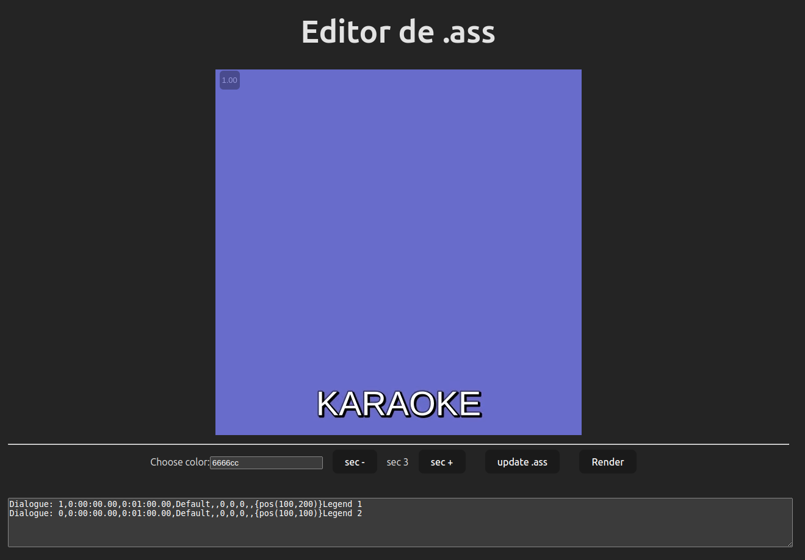
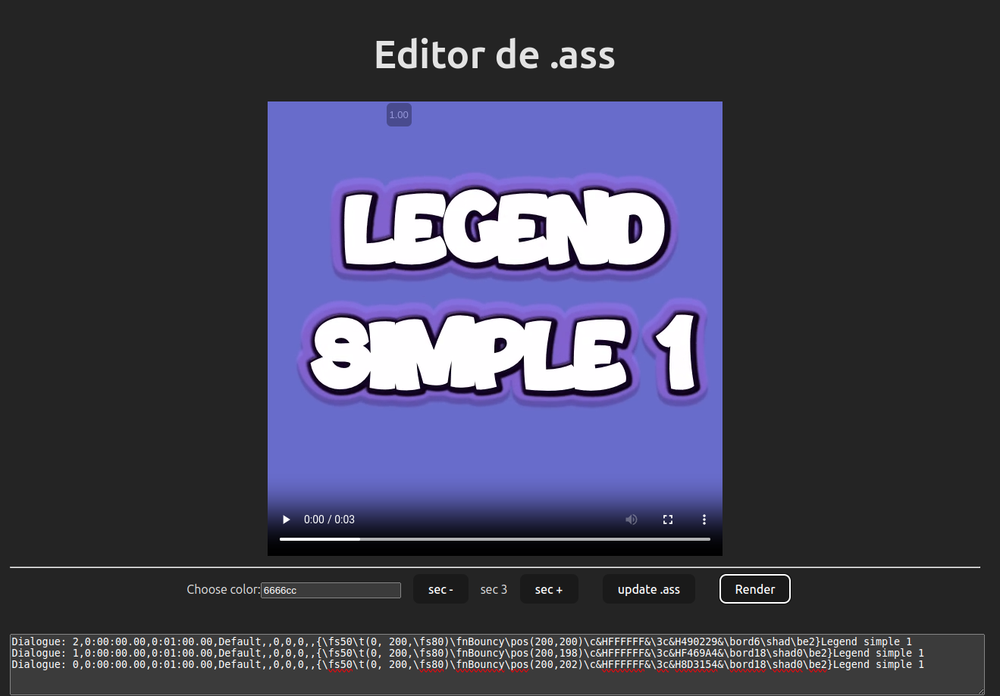
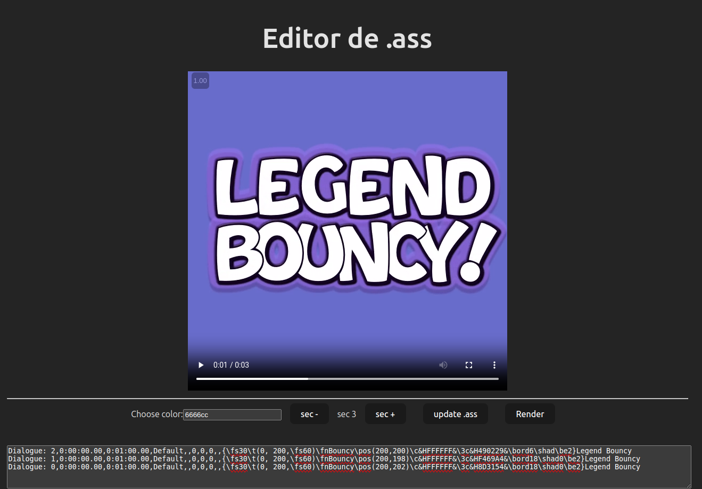

## O que faz?
Uma forma simples e rápida de testar novas estilos de fonte .ass config

## Requisito
Para usar os exemplos deve instalar todas as fontes no sistema
https://www.dafont.com/komika-axis.font
https://www.dafont.com/bouncy-2.font
https://fonts.google.com/specimen/Dela+Gothic+One


## Como iniciar


```bash
yarn
yarn dev
yarn server
```

exemplos:



